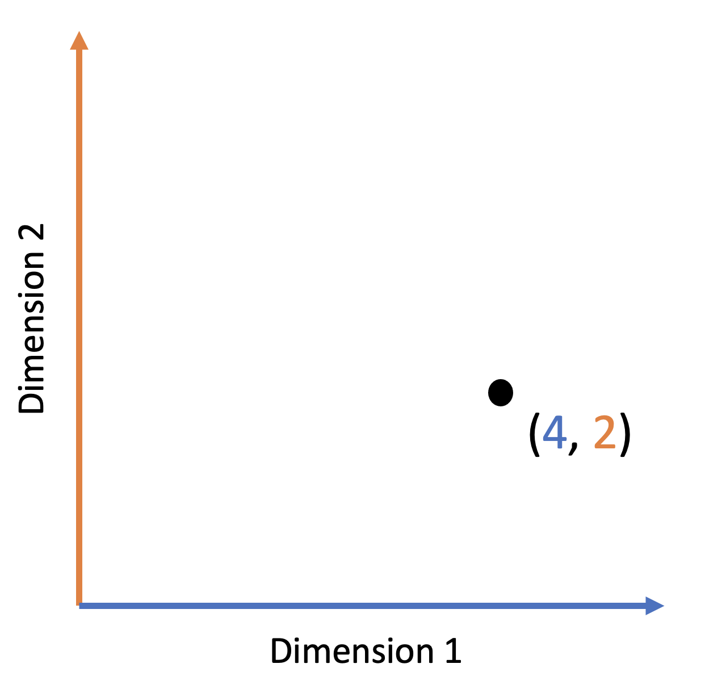
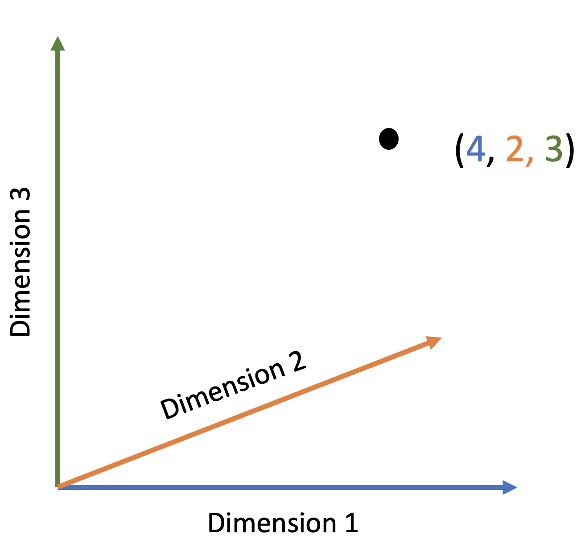
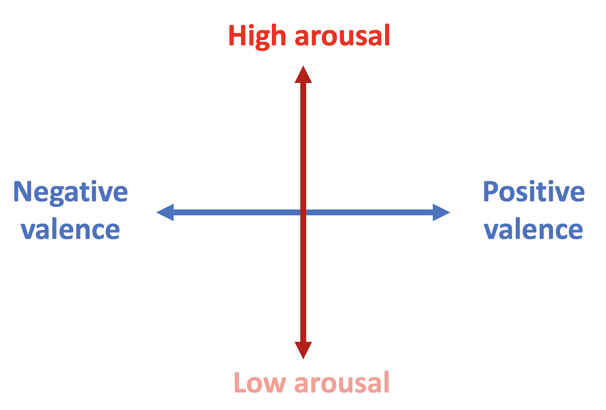
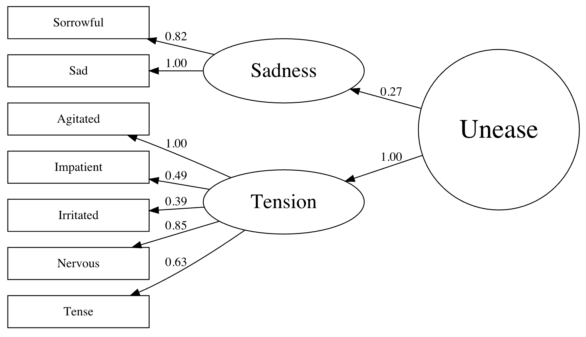
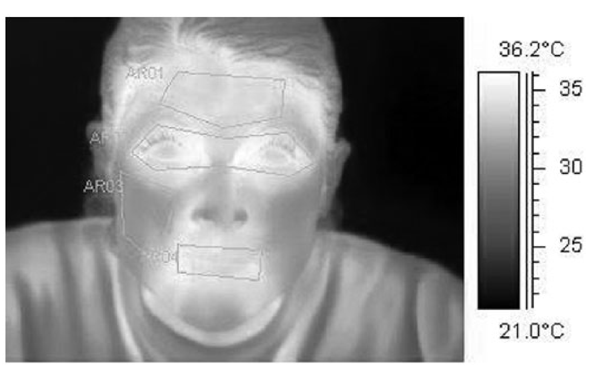
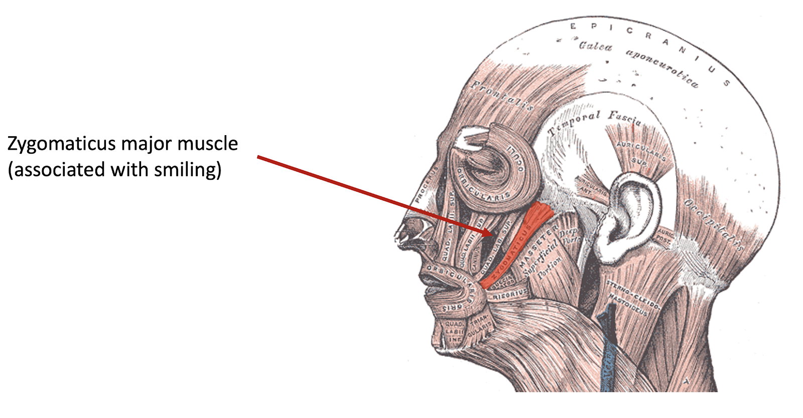
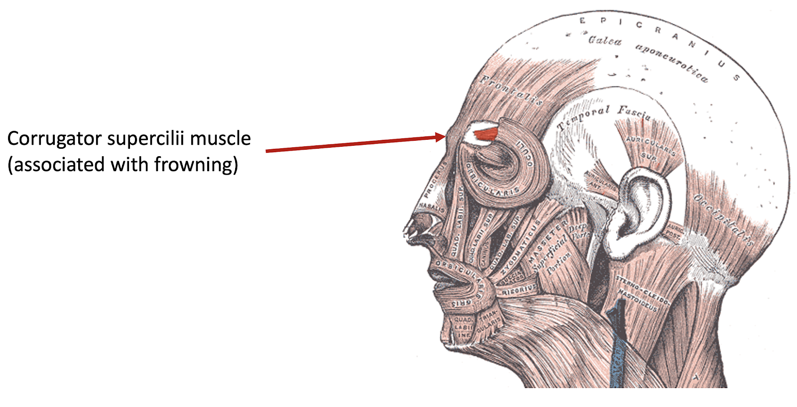
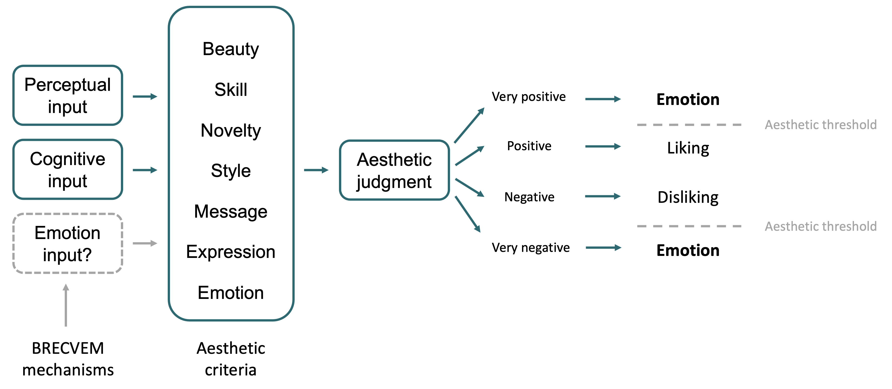

# Emotion

## Introduction to emotion and music

We're very used to describing emotions with language. We have many different words to use, each of which evokes a particular facet of human emotional experience. If I say the word 'disgust', you know exactly what I mean -- that feeling when I bite into a rotten apple, or open the rubbish bin, or step in dog faeces. If I say the word 'amazement', you likewise know instantly what I'm talking about: a special combination of surprise and disbelief.

Music's capacity to express emotion is very different. On the one hand, it lacks some of the expressive specificity of language. It's quite hard to write a melody that unambiguously connotes the emotion of 'disgust', for example.

Music does have some special advantages in its relationship with emotion, though. One feature is a particularly strong power to induce certain emotions in the audience. This feature underpins ways in which music is used across the world, for example in the context of lullabies, love songs, war songs, and religious ceremonies. In Western society, we regularly experience this emotional power in the context of TV and film. As audience members, we are so used to our emotions being manipulated in this way that we barely notice it any more.

This power of emotion induction becomes particularly interesting when the music is created interactively by several people playing or singing together. The music becomes a vehicle both for expressing one's own emotions, and for experiencing emotions expressed by others in the group. The result is a special kind of shared, synchronous emotional experience.

We're going to focus on a few key topics in this chapter. We'll start by covering definitions of core concepts, such as emotion, mood, and affect. We'll go through several current psychological models of emotion, some of which are general psychological models, and some of which are specific to aesthetics or to music. We'll discuss various methods for studying emotions in laboratory contexts, many of which are well-suited to musical applications. Finally, we'll discuss specific mechanisms by which music induces emotion.

### Definitions

Many scientific terms related to emotion do have intuitive meanings from day-to-day life. We do have to be careful though when we apply these terms in a scientific context -- we need to be quite precise about what we mean, otherwise we can end up tying ourselves in knots. This is all made particularly difficult by the fact that there's still not a complete scientific consensus about what many of these terms mean.

#### Emotion

The [APA Dictionary of Psychology](https://dictionary.apa.org) defines emotion as "a complex reaction pattern, involving experiential, behavioral, and physiological elements, by which an individual attempts to deal with a personally significant matter or event."

What do we mean by a reaction pattern? Let's take 'fear' as an example. As stated in the definition, the reaction pattern must comprise three components: experiential, behavioural, and physiological.

-   The *experiential* component is what the mind has conscious access to. When I say "I feel scared", I'm giving a label to the subjective experience of fear. Typically the emotion will be grounded in a particular object, event, or circumstance. For example, I might experience fear of a snake, or fear of stepping onstage to give a musical performance.

-   The *behavioural* component concerns what physical actions we perform with our body. Experiencing an emotion doesn't mean that we have to enact these physical actions; instead, the emotion provides a 'tendency' to enact these actions. In the case of fear, one action tendency might be to freeze, so that I don't make the situation any worse by disturbing the snake. A second action tendency might be to make a particular facial expression, to communicate my fear to other members of my species (or 'conspecifics', as we can call them). If I'm particularly scared, I might also make a vocal expression, like a scream. This has a similar function of communicating to conspecifics.

-   The *physiological* component prepares the body in various ways for future action. In the case of fear, this could mean a raised heart rate, increased perspiration, suppressed digestion, and various other kinds of things that should help me to respond to the salient threat.

We can identify several important functions of these reaction patterns in survival contexts:

-   One is **preparing the body** for an anticipated future. For example, a raised heart rate in the context of fear prepares the individual for subsequent physical exertion, so that they can overcome the current threat.

-   A second important function is **signalling to others**. This will typically be through some combination of facial and verbal expressions. Signalling emotions is very useful in a social context; it helps individuals to work together to overcome threats, and it helps them to build stable social relationships built on mutual trust.

-   A third function is **promoting desirable behaviour** in the individual. For example, a fear of heights is adaptively useful because it discourages me from standing in dangerous locations (such as cliff edges) where I might be likely to fall and hurt myself.

Let's revisit the last part of the APA's definition of emotion: "by which an individual attempts to deal with a personally significant matter or event". This part of the definition is particularly controversial in the context of music emotion research, because the emotions that music induces are generally *not* to do with any personally significant matter or event. Some people respond by saying that the definition is at fault, in that it is overly restrictive. Others respond by saying that musical emotions aren't 'real' emotions, precisely because they fail to satisfy all of these criteria.

This debate on the validity of musical emotions has a long philosophical history which we won't dive into here. However, we will suggest a slightly modified and more inclusive definition of emotion that sidesteps this controversy: "Emotion is a complex reaction pattern, involving experiential, behavioural, and physiological elements, typically (but not exclusively) elicited as a response to a personally significant matter or event."

#### Mood

Mood is a related concept to emotion. The APA Dictionary of Psychology defines mood as "a disposition to respond emotionally in a particular way that may last for hours, days, or even weeks, perhaps at a low level and without the person knowing what prompted the state." In other words, the key differences between emotions and moods would be:

-   Emotions typically have short duration, whereas moods have long duration;

-   Emotions typically have moderate to high intensity, whereas moods have low intensity;

-   Emotions typically have obvious causes that are available to conscious introspection, whereas moods do not necessarily have obvious causes, at least from the perspective of the person who's having the mood.

#### Feeling

We can define 'feeling' as "the subjective experience of an emotion or mood". In the context of emotions, the 'feeling' corresponds to the experiential component of the three-part response pattern we described earlier.

#### Affect

We can then define 'affect' as an umbrella term that encompasses emotions, moods, and feelings. This is a useful term to use when we don't want to commit to one of these finer categories.

#### Expression, perception, induction

There are various things that we can do with affects. We can *express* them, we can *perceive* them, and we can *induce* them.

When we say that someone 'expresses' an affect, we mean that they are creating a signal for the affect that could theoretically be recognised by someone else. This signal could either be automatic and subconscious (like many facial expressions), or it could be conscious and intentional, for example crafting a melody in order to capture a particular emotion. 

When we say that someone 'perceives' an affect, we mean that they are recognising a potential signal for an affect. This could mean listening to someone's voice, and inferring that they are angry; it could also mean listening to a piece of music, and hearing it as 'sad'. It doesn't matter whether the recognised affect actually exists in the mind of the original speaker, or in the music itself: the important thing is the listener's interpretation of that signal.

When we say that something 'induces' an affect, we mean that it causes someone to experience an affect. This is by definition primarily an involuntary process, although in practice the listener may have some control over their response to the stimulus. An example would be if hearing a child cry made me sad, or if hearing a piece of music made me happy. Experiencing an affect is generally harder to achieve than simply perceiving an effect. It's easy to play someone some music and have them identify it as sad, but it's much harder to induce an actual feeling of sadness using this music.

## Modelling emotion

In the previous section we ended up with the following definition of emotion: "Emotion is a complex reaction pattern, involving experiential, behavioural, and physiological elements, typically (but not exclusively) elicited as a response to a personally significant matter or event."

It's possible to imagine an almost infinite number of ways in which an individual can respond to a 'personally significant matter or event', especially if we are including all three components of experience, behaviour, and physiology. We need some kind of way to make sense of all of these possible reaction patterns. This is the purpose of emotion models: to organise this space of potential reactions in a meaningful way.

We're going to cover a few different emotion models in this session. They're not *computational* models, in the sense of Chapter \@ref(computational-music-psychology) -- they're better described as *theoretical* models. These models fall into two main categories: *dimensional* models and *categorical* models.

### Dimensional models

Dimensional models express emotions as points in continuous space. The location of a point in continuous space is fully specified by a series of numbers, with one number corresponding to each dimension.

For example, consider this point in 2-dimensional space. It has the coordinates (4, 2). This means it has a score of 4 on dimension 1, and a score of 2 on dimension 2.

{width="300"}

These continuous spaces can have arbitrary numbers of dimensions. In this next example we have three dimensions. Our point is located at coordinates (4, 2, 3), corresponding to scores of 4, 2, and 3 on the three dimensions respectively.

{width="300"}

The best-known dimensional model of emotions is the *circumplex* model, introduced by Russell in 1980 [@russell1980]. This is a very simple model, with just two dimensions. It works surprisingly well nonetheless.

The first dimension is the *arousal* dimension. Emotions can vary in a continuous way between low arousal and high arousal.

Arousal is associated with subjective energy levels. When in a state of high arousal, we feel awake, activated, and reactive to stimuli. This subjective feeling is coupled with a variety of distinctive physiological features, including increased heart rate, increased blood pressure, increased perspiration (i.e. sweating), increased respiration (i.e. breathing) rate, increased muscle tension, and increased metabolic rate. Together, these different physiological features serve the function of preparing the individual to perform some kind of physical or mental task in the near future.

The second dimension is the *valence* dimension. Emotions can vary on a continuous scale between very negative valence and very positive valence. Positive valence corresponds to what we might call 'good' feelings. Positive valence is a desirable state to be in. In contrast, negative valence corresponds to bad feelings, and an undesirable state. In an emotional context, the primary function of valence is presumably to encourage the individual to take decisions that are good for the organism's security, longevity, and reproductive success.

If we put these two dimensions together, we get the so-called circumplex model of emotion:

{width="300"}

The idea then is that an individual's emotional state at a particular point in time can be represented in terms of their locations on these two dimensions of arousal and valence.

-   Imagine a footballer who just scored a goal, and is performing a victory celebration: we'd expect them to be experiencing **high arousal** and **positive valence**.

-   If I'm running to catch a train, I'm probably in a state of **high arousal** but **negative valence**. The arousal helps me to run faster, whereas the low valence discourages me from cutting it so fine next time.

-   If I'm bored at work, that's probably a state of **low arousal** and **negative valence**.

-   Lastly, if I'm cozy in bed, I'd expect both **low arousal** and **positive valence**.

While the circumplex model works fairly well with just two dimensions, we can get further by adding more dimensions. One example is the 'Pleasure, Arousal, Dominance' model, which we can abbreviate to the 'PAD' model [@mehrabian1974approach]. Two of the PAD model's dimensions correspond closely to dimensions of the circumplex model: the PAD model's Pleasure-Displeasure dimension corresponds closely to the circumplex model's valence dimension, and the PAD model's Arousal-Nonarousal dimension corresponds to the circumplex model's arousal dimension. The main difference is the new third dimension, the Dominance-Submissiveness dimension.

This new Dominance-Submissiveness dimension helps us to distinguish certain important emotions that were indistinguishable under the circumplex model. Take anger and fear, for example: they are both essentially equivalent under the circumplex model, because they both corresponded to negative valence and high arousal. The new Dominance-Submissiveness dimension distinguishes both these emotions: anger corresponds to dominance, whereas fear corresponds to submissiveness.

### Categorical models

As implied by the name, categorical models organise the space of all possible emotions into a set of discrete categories, each with its own special set of identifying characteristics.

The English language already provides many different words to describe emotion-related concepts. If we wanted, we could treat each word as its own emotional category, and this would make sense in a certain way: words are rarely ever exact synonyms, and each one will provide its own particular set of connotations and implications. However, this wouldn't be all that useful for helping us to understand the psychological nature of emotion: we'd have many, many different categories, and no good idea of which ones are more important or fundamental than others.

One useful concept here is Ekman's concept of basic emotions [@ekman1999]. Ekman's argument is that we should understand the psychology of emotions in terms of a set of so-called 'basic emotions', which are the building blocks for all of human emotional experience.

Ekman specified a strict set of requirements for something to count as a basic emotion. These are specified in detail in @ekman1999:

-   First, it must have a set of distinctive *universal signals*; these signals function to communicate one's emotional state with conspecifics. According to Ekman, these signals should be shared cross-culturally.

-   Second, the emotion must have a distinctive *physiological signature*, encompassing variables such as heart rate and perspiration.

-   Third, the emotion must possess an automatic *appraisal mechanism*: in other words, the emotion must arise spontaneously as a reaction to a situation, rather than being the consequence of careful and considered thought.

Lastly, the emotion must possess universal *antecedent events*: that means that the same kinds of events should elicit the same emotions cross-culturally. For example, we might suppose that rotten food always elicits disgust.

To take one example, these definitions rule out 'nostalgia' as a basic emotion. Nostalgia does not have a clear set of distinctive universal signals, or a clear set of associated physiological manifestations.

Ekman identified a core set of emotions that do fulfil these basic criteria. These are: anger, disgust, fear, happiness, contempt, sadness, and surprise. It's worth going through each of these and thinking about how humans signal these emotions, how our behaviour is influenced by these emotions, and how our body reacts physiologically to them.

Ekman also identified a collection of other emotions that might one day be proved to be basic emotions. These candidates include things like sensory pleasures, amusement, relief, and excitement.

So, to summarise Ekman's perspective: he's claiming that we should be careful about what we call an 'emotion'. It's best to focus on 'core' or 'basic' emotions that are universal across the human species, and that have distinctive manifestations in terms of subjective experience, physiology, and signalling.

### Dimensional versus categorical models

Both dimensional and categorical approaches have their own advantages and disadvantages. This makes different approaches useful in different situations.

The dimensional models provide particularly efficient summaries of relationships between emotions. This is very useful in helping us to organise the great diversity of potential emotional experiences in an understandable way. If we're lucky, the underlying dimensions for these models can also have biological significance, in corresponding to underlying physiological mechanisms. The arousal dimension of the circumplex and PAD models is a good example of this, corresponding to a collection of clearly identifiable physiological variables.

The main limitation of the dimensional models is their limited expressivity. It is often quite easy to think of pairs of emotions that have clearly distinct response patterns, but have similar representations under a given dimensional model. So, in themselves, dimensional models struggle to provide a complete account of human emotion.

Categorical emotions address this problem quite well. They are well-suited to capturing subtle differences between emotions: any time you want to differentiate two emotions, you can just create a new category.

However, this flexibility is also the weakness of this approach. It's easy to create more and more categories to capture various nuances of emotion, and eventually you end up with a long 'shopping list' of many different emotion terms, with no clear structure behind it. In order to understand how these terms fit together, you then have to start thinking about a supplementary organisation scheme, for example organising them into a hierarchical taxonomy, or overlaying them onto a dimensional model and so on. So, the two approaches can work quite well together.

There is still an important underlying psychological question here, and that is whether human emotions are fundamentally organised into categories or not, or whether the space of possible emotions is fundamentally continuous. This question is still being debated in the literature, and there is still no clear answer. Unfortunately, the conclusion seems to depend a lot on how you define emotion...

### Aesthetic and musical emotions

We're now going to move from Ekman's basic emotions model onto emotion models that specifically concern aesthetic and musical emotions. These models typically take a much more relaxed approach to deciding what might constitute an emotion. In particular, many of the emotions being described in this context don't have any well-established physiological correlates or universal signals.

#### Geneva Musical Emotions Scale (GEMS)

The Geneva Emotional Music Scale (GEMS) was introduced by @Zentner2008-mv. Compared to the 'basic emotions' model discussed earlier, the GEMS has a much more inclusive definition of emotions. Instead of working under strict definitions of what features are needed to make something an emotion, the authors instead compiled a very broad set of terms from the literature and from other sources, and used a data-driven approach to work out which terms were most relevant for musical applications.

The way this worked is that the authors conducted a series of experiments based on self-report questionnaires, designed to probe how people experience emotions in musical contexts. These experiments were centred on two main questions. First, what emotions are most commonly induced by musical experiences? Secondly, what emotions tend to co-occur with each other in these musical experiences?

The output of this work was the following emotion model:

(\#fig:unnamed-chunk-2)The factorial structure of the GEMS, redrawn after @Zentner2008-mv.

The model is hierarchical, in that it describes musical emotions in terms of three nested layers. The top layer has just three categories: sublimity, vitality, and unease. The second layer splits these categories into subcategories: for example, unease is split into tension and sadness, whereas vitality is split into power and joyful activation. Each of these subcategories is then split into more granular terms: for example, sadness is split into 'sad' and 'sorrowful'. This nested structure gives us an idea about how different kinds of emotional experiences tend to go together in music listening contexts.

One interesting thing to see from this model is a clear *positivity* bias. The most commonly reported emotions are positive ones, such as wonder, transcendence, and tenderness: negative emotions, such as tension and sadness, play a comparatively small role.

The analysis approach of the GEMS identifies certain 'factors' corresponding to emotion terms that often go together in musical experiences. For example, the makeup of the 'Tension' term tells us that the terms 'agitated', 'nervous', 'tense', 'impatient', and 'irritated' tend to occur in conjunction when people talk about musical experiences. This doesn't necessarily tell us though that there is an underlying unitary emotion called 'tension', certainly not according to Ekman's definition of basic emotions. However, this co-occurrence does suggest a meaningful connection between these different emotional concepts in terms of the musical features that elicit them. These connections could be probed in more detail in experimental studies.

#### Aesthetic emotions

*Aesthetic emotions* concern the perception of beauty in a wider context: not just music, but also artworks, landscapes, architecture, and so on.

@menninghaus2019 have presented a detailed case for the notion of aesthetic emotions. Their conceptualisation organises aesthetic emotions into two main classes.

The first class corresponds to aesthetic versions of 'ordinary' emotions. These emotions correspond to an 'ordinary' emotion, such as joy, amusement, or nostalgia, or surprise, that an aesthetic object can induce in us.

The second category contains emotions that concern the appreciation of aesthetic virtues. This category might include emotions such as 'the feeling of beauty', 'the feeling of sublime', 'the feeling of groove', and so on.

The authors make various important observations about aesthetic emotions:

-   **Aesthetic emotions are deeply linked with pleasure and displeasure**. They therefore make an important contribution to the overall attractiveness of an aesthetic experience.

-   **Pleasure is largely determined by the intensity of the aesthetic emotion**. So, we can experience pleasure on account of an intense feeling of joy, of amusement, of beauty, of sublimity, and so on.

-   **An intense experience can be pleasant**, even for an aesthetic emotion that corresponds to a 'negative' ordinary emotion. For example, if music evokes a strong feeling of sadness, this will generally still correspond to a pleasant aesthetic experience.

The authors also note that aesthetic emotions possess important and necessary characteristics of 'ordinary' emotions. They are associated with clear physiological variables, such as heart rate, perspiration, and chills; they are associated with clear signals, such as laughter, tears, and smiling; they're also associated with clear behavioural outcomes, such as a tendency to end, extend or repeat exposure to the aesthetic object. That said, it's important to note that these features are not necessarily 'distinctive' in the way required by Ekman's definitions of basic emotions; most of the time, they seem to co-opt response patterns from pre-existing basic emotions, such as happiness and sadness.

This leads us onto an important open question in the literature: do we really need to posit aesthetic emotions as a separate category of emotion? There is an interesting series of response articles in the literature debating this point. The skeptic's position (e.g. [@skov2020]) is that aesthetic emotions are best understood in terms of 'ordinary' emotions. These emotions might be experienced in a special combination, perhaps even a combination that is difficult to achieve in normal life (e.g. anger and happiness). They might also be experienced in an unusual presentation: for example, experiencing sadness in an aesthetic context might remove its behavioural components (which typically make sadness an unpleasant experience) while leaving other components of physiology, signalling, and subjective experience unaffected. This is all still a topic of debate, and there's no clear resolution in sight!

### Conclusions

Emotion is something of a paradoxical topic to study psychologically. On the one hand, as humans we are all intuitively aware of what it means to experience emotions, in a way that arguably can never be expressed fully in words. This can make a lot of this topic feel trivial, in a certain way. On the other hand, when we dig deeper, we realise that there are some very deep issues here that deserve careful examination.

The models we talked about today -- dimensional and categorical models -- can help us to structure these investigations. We talked about two particular examples of dimensional models: the two-dimensional circumplex model, and the three-dimensional PAD model. We then talked about three categorical approaches to emotion: the basic emotions theory [@ekman1999], the GEMS musical emotions model [@Zentner2008-mv], and the aesthetic emotions model of @menninghaus2019. They make for quite interesting comparisons. We're still waiting though for a proper combined model that convincingly accounts for all of these phenomena together.

## Measuring emotional responses

This section introduces various ways that we can measure emotional responses in the context of psychological experiments. Broadly speaking, we can organise these measurement techniques into three primary categories: self-report measures, physiological measures, and neural measures.

### Self-report

The idea behind self-report measures is simply to ask the participant about their emotional experiences. This relies on the fact that, at least in Western society, most adult participants have fairly sophisticated vocabularies for describing their emotional experiences.

There are many ways in which we could ask someone about their emotional experiences, in more or less structured ways. A particularly common approach though is to use rating scales; here we simply ask people to describe an emotional experience by rating it according to various criteria, for example 'joyfulness' or 'anger'. These numbers can then be aggregated to provide a quantitative summary of the participant's emotional responses.

There are various kinds of rating scales we could use here. One prominent option is the Geneva Emotional Music Scale, or 'GEMS' (Zentner et al., 2008), which we discuss in Section \@ref(modelling-emotion).

The GEMS takes many different emotion terms (on the left hand side here), and clusters them together into a three-level hierarchy. The scale was constructed in a data-driven way: the emotion terms are terms that frequently occur when people describe music-induced emotional experiences, and the higher-level clusters (or 'factors') describe how these different emotion terms tend to co-occur with each other.

We can use the GEMS to make questionnaires for quantifying certain kinds of core emotional responses to music. For example, suppose I want to quantify the tension that someone experiences when they listen to a particular piece of music. The GEMS tells me that a good way to do that is to give the participant rating scales for five adjectives: agitated, nervous, tense, impatient, and irritated. I get the participant to rate their experience on these five adjectives. I then combine their results, for example by averaging, and this gives me an overall 'tension' score. Similarly, the GEMS tells me that I could compute scores for a general 'unease' factor by first computing scores for 'tension' and 'sadness', and then combining them.

{width="600"}

This kind of approach has several advantages. It's easy to get data for very specific adjectives: if I'm interested in nostalgia, I can simply ask the participant 'to what extent does this music make you feel nostalgic'? The approach is also rather efficient -- it only takes a moment for the participant to record what emotion they feel. There's also no need for expensive laboratory equipment, all you need is pen and paper.

However, there are some important disadvantages. The results are mediated by the participant's vocabulary, and this is problematic for working with people with limited vocabularies, as well as for generalising the paradigm across different languages or cultures. There's also a problem that participants can easily get confused between the two concepts of 'expressed' and 'induced' emotion. In a particular study, we might be specifically interested in what kinds of emotions the music makes the participant *feel*, but if we ask the participant to describe what emotions the music makes them feel, it's quite common for the participant to mistakenly describe what emotions the music seems to be expressing.

### Physiological

#### Heart rate

An obvious thing to measure is the heart rate; this can be achieved with inexpensive and unobtrusive heart rate monitors. Many smart watches nowadays even include heart rate monitors as standard. Two aspects of heart rate are typically monitored: the absolute value and the variability. The arousal component of emotion is typically associated both with high absolute values and high variability in values, reflecting the body's preparation for imminent physical exertion.

#### Respiration rate

The respiration rate corresponds to the number of breaths that the participant takes per minute. One way of measuring this is with a 'pneumograph', as displayed here: a pneumograph measures respiration by tracking chest movements. High respiration rates are associated with high arousal.

.jpg), no restrictions, via Wikimedia Commons](images/pneumograph.png){width="300"}

#### Goosebump recorder

Intense emotional experiences, especially in the context of music, are often accompanied by skin tingling and goosebumps, corresponding to a process called 'piloerection' where body hairs stand on end. These experiences are called 'chills'. It's possible to record the development of goosebumps using custom cameras placed for example on the participant's arm.

, [CC BY-SA 4.0](https://creativecommons.org/licenses/by-sa/4.0), via Wikimedia Commons](images/piloerection.gif){width="300"}

#### Skin conductance response

Increased arousal is associated with increased perspiration, or sweating. It's possible to quantify this perspiration effect by measuring the so-called 'skin conductance response'. Here we place two electrodes on the skin, and pass a small current between them. The ease with which this current travels depends on the skin's conductance, and this conductance depends on perspiration levels: increased levels of perspiration correspond to greater levels of conductance.

#### Skin temperature

Skin temperature provides another proxy for arousal. We can measure skin temperature with an infrared camera, for example. Increased arousal tends to be reflected in a drop in nasal skin temperature, as a result of restricted blood flow in peripheral regions.

{width="350"}

#### Facial electromyography

Facial electromyography is based on the observation that certain emotions tend to elicit certain universal facial expressions, for example smiling or frowning. Often the participant will not smile or frown in a significant enough way for this smile or frown to be detected by an external observer; however, if we measure muscle activity in certain facial muscles, we may still be able to detect some signs of stimulation. This is what facial electromyography is for: we place electrodes next to certain muscles in the face, and record electrical activity at the locations of these muscles. For example, we can place electrodes on the zygomaticus major muscle, and this can give us a proxy of smiling. We can also place electrodes on the corrugator supercilii muscle, which is associated with frowning.

{width="500"}

{width="500"}

Unfortunately, this can be quite an invasive procedure for the participant, with their face ending up being covered in electrodes. In practice, it can be preferable to use a less invasive method of facial monitoring instead, such as a video camera, sacrificing some sensitivity for the sake of a more naturalistic listening experience.

#### Pupillometry

Pupillometry can also provide an insight into a participant's emotional responses. Normally, the pupil dilates (i.e. expands) and contracts depending on light levels, but pupil dilation also occurs in the context of arousal and surprise. We can record these dilation responses by focusing a camera on the participant's eye and recording their pupil size over time.

](images/pupil.jpg){width="250"}

#### Conclusions

These physiological measures have certain important advantages. One advantage is we avoid having our results mediated through vocabulary; this means that we can easily apply the same methods to many different populations, including cross-cultural populations or linguistically impaired populations. A second advantage is that these measures are by definition necessary if we want to understand the full response pattern underlying a particular emotion. As we discussed before, the definition of an emotion typically includes a physiological component, and we must characterise this physiological component properly if we want to understand the emotion.

Unfortunately, physiological measures come with their own disadvantages. They tend to produces rather noisy data streams, which means in practice that we need more participants or longer testing sessions in order to reach sufficient reliability levels. It's also rather difficult to distinguish emotions in fine detail using these methods. If we want to distinguish emotions that vary solely on arousal, these methods can work pretty well, but other kinds of distinctions are harder to make. Lastly, the methods can be invasive to a certain degree. Anything that involves placing a physical device on the participant will introduce some distraction and potentially alter the nature of the listening experience.

### Neuroimaging

The purpose of neural measures is to get some insight into the brain processing underlying a particular emotional response.

There are many different neural measures out there, but here we will focus in particular on *functional* *magnetic resonance imaging*, or fMRI. This method is particularly attractive for emotion studies because, unlike several other methods, it is well-suited to accessing the deeper brain regions that tend to be associated with emotion processing. The method is also particularly good at providing precise spatial localisation of activity within the brain, which is helpful for differentiating the precise processes that are going on.

fMRI assesses blood oxygen levels in different regions of the brain, which provide a relatively real-time marker of ongoing neural activity. By looking at the locations of this neural activity, we can hypothesise about what brain areas are involved in a particular cognitive process.

](images/fmri.jpg){width="300"}

Through this process, neuroscientists have identified various regions of the brain involved in various aspects of emotional responses to music. One such region is the *amygdala* -- this is implicated in both pleasant and unpleasant emotions, particularly fear, anxiety, and aggression. It's thought to be involved in coding music's affective positivity or negativity.

, public domain, via Wikimedia Commons](images/amygdala.jpg){width="450"}

The *nucleus accumbens,* which is part of the ventral striatum, seems to be another important region in explaining emotional responses to music. In general psychological contexts, the nucleus accumbens has been implicated in motivation, aversion, and reward. In the context of music, the nucleus accumbens seems to be particularly involved in the generation of pleasure.

, [CC BY-SA 4.0](https://creativecommons.org/licenses/by-sa/4.0), via Wikimedia Commons](images/nucleus-accumbens.png){width="400"}

Lastly, there's the *hippocampus*. The hippocampus seems to have many different functions, but in the context of general emotion research it has been linked to tender positive emotions and behaviours such as joy, love, compassion, empathy, grooming, and nursing offspring. This seems to translate over to music emotion studies, which have found the hippocampus to be involved in various music-evoked emotions including tenderness, peacefulness, joy, and sadness.

, public domain, via Wikimedia Commons](images/hippocampus.jpg){width="400"}

These kinds of neural measures have a very important advantage over the other methods, which is that they can identify specific brain regions involved in particular experimental contexts.

They do however have some important disadvantages. One is that they involve expensive equipment -- an fMRI machine will cost many hundreds of thousands of pounds, and is expensive to maintain. fMRI machines in particular tend to be rather noisy, which can be problematic in music experiments for obvious reasons. The final issue is perhaps the deepest, and concerns the interpretation of the results. Any particular brain region will typically have multiple functions, and so decoding patterns of brain activations is a very complex task. It's not possible right now to look at an fMRI scan and say 'aha, this person is experiencing nostalgia...'.

### Conclusions

Here we covered three different approaches to measuring emotions that could be applied in music studies: self-report measures, physiological measures, and neural measures. These methods all bring their own strengths and weaknesses, and we arguably need all of them if we want to fully characterise an emotional response. In practice though, we're limited by the available resources. Self-report measures end up being particularly popular as a result!

## Mechanisms for inducing musical emotion

This section is about different mechanisms by which music seems to induce emotions. We're going to focus on a particularly influential theoretical model by Juslin, called the **'BRECVEM'** model. This model is described in a 2008 paper in Behavioral and Brain Sciences by Juslin and Västfjäll [@juslin2008]. This is a really good paper to read if you have the time. As well as providing a detailed and well-organised exposition of the model, the paper also includes a large number of commentaries by various other researchers in the field. This gives you an insight into various complementary perspectives on the topic, and can really help you to develop your own personal opinion about the ideas.

A few years later, Juslin wrote a paper that extends the BRECVEM model to add an additional component, concerning aesthetic judgments [@juslin2013]. The result is then called the BRECVEMA model. It's this particular version of the model that we'll focus on today. I'd still recommend keeping the original BRECVEM paper as a primary reference though, because it contains particularly detailed expositions of the first seven components of the model.

There are eight components of the full BRECVEMA model: brain stem reflex, rhythmic entrainment, evaluative conditioning, emotional contagion, visual imagery, episodic memory, musical expectancy, and aesthetic judgment. Let's consider each in turn.

### Brain stem reflex

The *brain stem* is one of the oldest parts of the brain, evolutionarily speaking. It has important responsibilities in regulating cardiac and respiratory function. The brain stem reflex is a hardwired attention response that reflects early stages of auditory processing; it's triggered by sounds that are 'surprising' in terms of basic auditory features. Most commonly this means a sudden and loud sound, especially if this sound feels 'sharp' or 'accelerating'. It's important to respond quickly to these kinds of sounds because they can reflect some kind of immediate threat. Depending on the context, the brain stem reflex can be experienced either as unpleasant or exciting, and is correspondingly linked to arousal.

### Rhythmic entrainment

Rhythmic entrainment is something of an umbrella term that captures many different modes of entrainment, or synchronisation. It could mean perceptual entrainment, the kind that happens naturally and automatically simply by listening to rhythmic music. It could mean motor entrainment, where you might tap along or dance to the beat. It could be physiological entrainment, where your breathing might synchronise with the music. It could be social entrainment, where you synchronise your movements with several others in your group, perhaps by dancing.

These processes of entrainment can have various implications. Rhythmic entrainment often ends up increasing arousal levels and causing pleasure. Entrainment also seems to evoke feelings of connectedness and emotional bonding; this is particularly true when the entrainment occurs in a group context, and involves multiple individuals synchronising with each other.

### Evaluative conditioning

Evaluative conditioning describes an effect whereby repeatedly pairing a piece of music with a given emotion ends up causing a listener to automatically associate that music with the emotion in the future. Importantly, this association doesn't require conscious awareness: the music can make you happy as a result of the association, but you don't know why you're happy. An example could be listening to a particular piece of music that you always used to play when you met your best friend.

### Emotional contagion

Emotional contagion depends on the fact that listeners will automatically recognise certain features in the music that are similar to markers of emotion in speech [e.g. @juslin2003a]. For example, if I'm feeling miserable, my speech is likely to be slower, with lower pitch variability, and drooping contour; if I'm feeling excited, my speech is likely to be faster, with higher pitch variability, and potentially a rising contour.

@Juslin2001a describes an interesting idea, termed 'super-expressive voice theory', stating that music's power of emotional contagion comes not just from the fact that music emulates the expressive capacities of the human voice, but from the fact that it far exceeds them, in terms of the potential manipulations of speed, intensity, and timbre. So, music is accessing the parts of the brain originally intended for interpreting speech expression, and sending them into overdrive.

### Visual imagery

This part of the model is based on the notion that music can (in certain listeners) conjure up certain visual images, such as beautiful landscapes. This effect depends on metaphorical, cross-modal associations, for example between ascending melodies and upward movement, or between rich textures and rich colours. The listener can then experience emotions that are a consequence of these visual images.

## Episodic memory

This effect is sometimes termed the "Darling, they are playing our tune" effect. It occurs when a listener has paired a particular musical piece with a particular personally significant memory, perhaps a particular event like a wedding or a Christmas party. Unlike the evaluative conditioning mechanism we discussed earlier, episodic memory by definition involves conscious recollection of the associated event. Historically speaking, music theorists haven't seen episodic memory as being particularly musically relevant, but survey data indicates that episodic memory is a very frequent source of music emotion induction in practice.

It's been noted for a while now that episodic memories (i.e. memories for particular events from one's life) tend to be particularly strong for events in youth and early adulthood, between about 15 and 25 years of age. A potential reason for this is simply that many self-defining experiences occur at this age, for example moving away from home, going to university, and gaining financial independence.

This effect seems to be reflected in a musical 'reminiscence bump', where music that we originally listening to in youth and early adulthood acquires special retrospective significance. Music from this period tends to be better recognised by the listener, more likely to evoke autobiographical memories, and more likely to evoke emotions.

### Musical expectancy

We talked about musical expectancy (or expectation) already in a previous section. Music listening generates real-time expectations in the listener; these expectations can then be violated, delayed, or confirmed. Simple violations of expectation, such as unexpected loud chords, may be processed by the brain-stem reflex; more sophisticated and style-dependent violations will depend on the listener's enculturated knowledge about musical styles, as represented in higher-level brain regions. These manipulations of expectation are associated with emotional phenomena such as anxiety, surprise, thrills, and pleasure.

### Aesthetic judgment

This part of the model is probably the most controversial; it's still not totally agreed that aesthetic judgment requires a separate emotion induction mechanism. This relates to the disputed topic of 'aesthetic emotions' that we discussed in a previous section: some researchers believe aesthetic emotions exist, but other researchers believe that so-called 'ordinary' emotions are all that we need to explain emotional reactions to art.

Below is a schematic diagram from Juslin's (2013) paper describing his conceptualisation of the aesthetic judgment process. The listener evaluates the music on several aesthetic criteria, listed here under the headings of beauty, skill, novelty, style, message, expression, and emotion. These different headings are unpacked in more detail in the paper. From these features, the listener makes an overall aesthetic judgment of the piece, which can be positive or negative. Different listeners may weight these different features differently; for example, listeners to avant-garde music might value novelty relatively strongly, but value beauty less. An emotional response then develops on the basis of this overall aesthetic judgment: strongly positive aesthetic judgements elicit positive emotions, whereas strongly negative judgments elicit negative emotions.

{width="100%"}

Personally, I think this final component of Juslin's model is rather speculative, and I'm not completely convinced by it yet. I think it provides a good basis for future exploration, though.

## Conclusions

We've now covered all the aspects of the BRECVEMA model of emotion induction. It's clear that there are many potential mechanisms by which music can induce emotions. This diversity of mechanisms is an important reason why music has such strong emotional effects on listeners -- it can activate these emotions in so many different ways.
